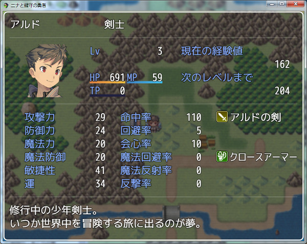

[トップページに戻る](README.md)

# [FTKR_CSS_DetailedStatus](FTKR_CSS_DetailedStatus.js) プラグイン

アクターのステータス画面のステータス表示を変更するプラグインです。<br>
本プラグインは、[FTKR_CustomSimpleActorStatus](FTKR_CustomSimpleActorStatus.ja.md)の拡張プラグインです。

ダウンロード: [FTKR_CSS_DetailedStatus.js](https://raw.githubusercontent.com/futokoro/RPGMaker/master/FTKR_CSS_DetailedStatus.js)

## 目次

以下の項目の順でプラグインの使い方を説明します。
1. [概要](#概要)
2. [プラグインの登録](#プラグインの登録)
3. [レイアウト設定](#レイアウト設定)
    1. [表示エリアサイズの設定](#表示エリアサイズの設定)
    2. [表示エリア間のラインの設定](#表示エリア間のラインの設定)
    3. [表示エリアの設定](#表示エリアの設定)
    4. [顔画像サイズの設定](#詳細ステータスの顔画像サイズの設定)
4. [ウィンドウの設定](#ウィンドウの設定)
    1. [プラグインパラメータの設定](#プラグインパラメータの設定)
    2. [ウィンドウ設定における補足](#ウィンドウ設定における補足)
* [プラグインの更新履歴](#プラグインの更新履歴)
* [ライセンス](#ライセンス)

## 概要

本プラグインを実装することで、ステータス画面で表示するアクターのステータス表示のレイアウトを変更できます。



[目次に戻る](#目次)

## プラグインの登録

本プラグインを使用するためには、[FTKR_CustomSimpleActorStatus](FTKR_CustomSimpleActorStatus.js)の事前登録が必要です。
プラグイン管理画面で、以下の順の配置になるように登録してください。
```
FTKR_CustomSimpleActorStatus.js
FTKR_CSS_DetailedStatus.js
```
[目次に戻る](#目次)

## レイアウト設定

レイアウトの設定方法は[こちら](FTKR_CustomSimpleActorStatus_1.ja.md)を参考にしてください。

### ステータス画面の表示エリアのその他の設定

`DS Space In Text*`

角括弧を使ったときの表示間隔を設定します。
`Actor Status Space In Text`の設定と同じです。

[目次に戻る](#目次)

## ウィンドウの設定
## プラグインパラメータの設定
以下のプラグインパラメータで設定できます。

### 設定の有効化
`Enabled Custom Window`

ステータス画面のステータスウィンドウ変更機能を使うか指定します。
* 0 - 無効(デフォルト)
* 1 - 有効

### フォントサイズ
`Font Size`

ウィンドウ内のフォントサイズを変更します。
デフォルトは 28 です。(単位はpixel)

### 余白サイズ
`Window Padding`

ウィンドウの周囲の余白を変更します。
デフォルトは 18 です。(単位はpixel)

### 行の高さ
`Window Line Height`

ウィンドウ内の1行の高さを変更します。
デフォルトは 36 です。(単位はpixel)

### 背景の透明度
`Window Opacity`

ウィンドウ内の背景の透明度を変更します。
デフォルトは 192 です。
0 - 透明、255 - 不透明

### ウィンドウ枠の非表示化
`Hide Window Frame`

ウィンドウ枠を非表示にするか指定します。
* 1 - 非表示にする
* 0 - 表示する(デフォルト)

## ウィンドウ設定における補足

### ウィンドウの高さ
ウィンドウの高さは以下の計算で自動的に設定します。
```
[ウィンドウ高さ] ＝ [縦の行数] × [1行の高さ] + [余白のサイズ] × 2
```

### フォントサイズと行の高さ
基本的に、下の大小関係になるように設定しましょう。
```
フォントサイズ ＜ 1行の高さ
```

### ウィンドウを消す方法
以下の設定にすると、ウィンドウ枠とウィンドウの背景が消えて、アクターのステータスだけを表示します。

`Window Opacity`     : 0 <br>
`Hide Window Frame`  : 1

[目次に戻る](#目次)

## プラグインの更新履歴

| バージョン | 公開日 | 更新内容 |
| --- | --- | --- |
| [ver2.1.4](FTKR_CSS_DetailedStatus.js) | 2018/12/13 | プラグインパラメータ初期値変更 |
| ver2.1.3 | 2018/10/20 | dsWeaponMasteryプラグインの熟練度表示に対応 |
| ver2.1.2 | 2018/09/29 | プラグインパラメータのリストで選択できる項目を追加 |
| ver2.1.1 | 2018/09/12 | 不要なプラグインパラメータ を削除 |
| ver2.1.0 | 2018/08/30 | FTKR_CustomSimpleActorStatus.js の v3.1.0に対応<br>ウィンドウの表示内容を自動更新する機能を追加 |
| ver2.0.0 | 2018/08/19 | FTKR_CustomSimpleActorStatus.js の v3.0.0に対応 |
| [ver1.1.0](/archive/FTKR_CSS_DetailedStatus_1.1.0.js) | 2017/11/18 | FTKR_CustomSimpleActorStatus.js の v2.6.0に対応 |
| ver1.0.2 | 2017/05/13 | ウィンドウ設定変更機能が正常に機能していない不具合を修正 |
| ver1.0.1 | 2017/05/08 | ウィンドウ設定変更機能を追加 |
| ver1.0.0 | 2017/04/21 | 初版作成 |

## ライセンス

本プラグインはMITライセンスのもとで公開しています。

[The MIT License (MIT)](https://opensource.org/licenses/mit-license.php)

#
[目次に戻る](#目次)

[トップページに戻る](README.md)